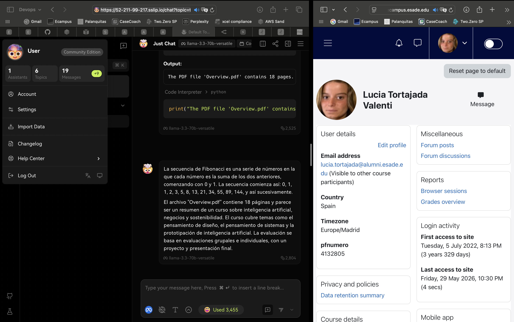
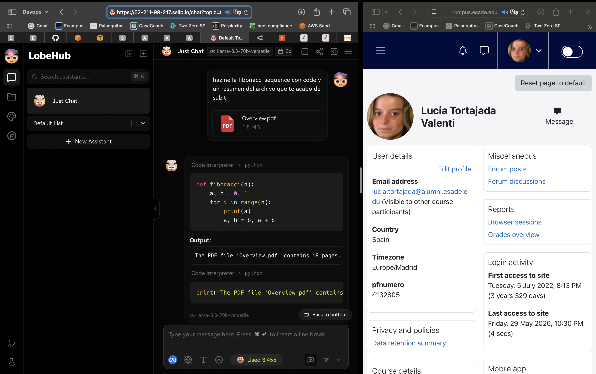

# Final Project — Evidence Report

## 1. Identity

| Field | Value |
|---|---|
| Student name | Lucia Tortajada Valenti |
| ESADE email | lucia.tortajada@alumni.esade.edu |
| GitHub repo URL | https://github.com/Lucia-Tortajada/lobechat-aws |
| Latest commit SHA | 645b9d8f7985e7e7a3aeb546f069ef7d7ec7e65f |
| Final tag | final-v1.0.0 |

## 2. Public URL


**[https://52-211-99-217.sslip.io]**

## 3. Screenshot — LobeChat over HTTPS, logged in




## 4. Screenshot — chat working (streaming + MCP)




## 5. Public reachability — `curl -sI https://<host>/`


```
$ curl -sI https://52-211-99-217.sslip.io/
HTTP/2 307
alt-svc: h3=":443"; ma=2592000
date: Fri, 29 May 2026 17:38:23 GMT
location: /chat
via: 1.1 Caddy
```

## 6. Negative test — port 47000 closed


```
$ curl -v --max-time 5 http://52.211.99.217:47000/

Trying 52.211.99.217:47000...
Connection timed out after 5002 milliseconds
curl: (28) Connection timed out after 5002 milliseconds
```

## 7. Stack runtime — `docker compose ps`


```
$ docker compose ps
NAME              IMAGE                        STATUS
casdoor           casbin/casdoor:v2.13.0       Up 27 minutes
hayhooks          deepset/hayhooks:v1.1.0      Up 37 minutes
hayhooks-mcp      deepset/hayhooks:v1.1.0      Up 37 minutes
lobe-chat         lobehub/lobe-chat-database   Up 5 minutes
mcphub            lobechat-aws-mcphub:latest   Up 37 minutes
minio             minio/minio:latest           Up 8 minutes (healthy)
qdrant            qdrant/qdrant:latest         Up 37 minutes (healthy)
shared-postgres   pgvector/pgvector:pg16       Up 37 minutes (healthy)
```
