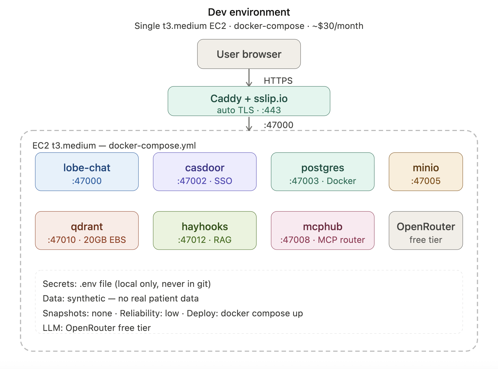
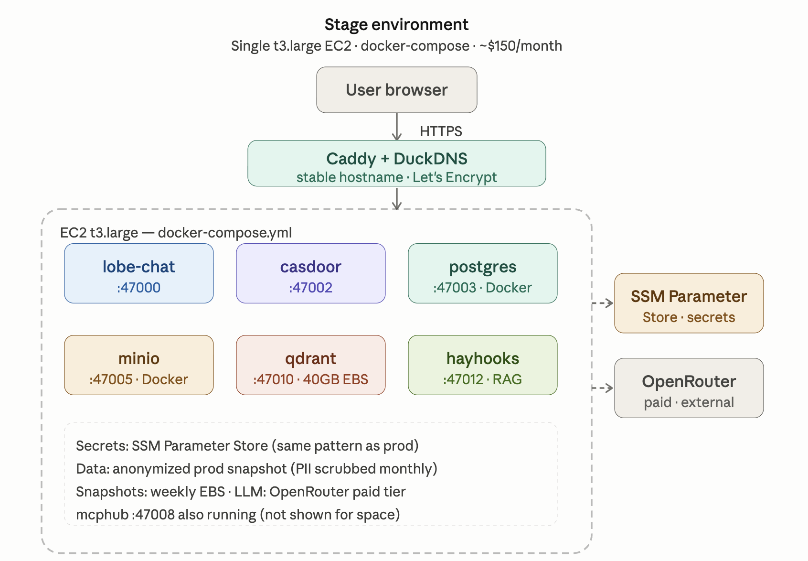

# Q2 — 3-environment architecture evolution

## Per-environment component table

| Component | Dev | Stage | Prod |
|---|---|---|---|
| LobeChat | t3.medium, single EC2, docker-compose | t3.large, single EC2, docker-compose | t3.xlarge EC2, behind ALB |
| Casdoor | Same EC2 as LobeChat | Same EC2 as LobeChat | Same EC2 as LobeChat, Secrets Manager for credentials |
| PostgreSQL | Docker container on EC2 | Docker container on EC2 | RDS PostgreSQL 16 (db.t3.medium, Multi-AZ) |
| MinIO | Docker container on EC2 | Docker container on EC2 | AWS S3 (native, not MinIO) |
| Qdrant | Docker container, EC2 t3.medium, 20GB EBS gp3 | Docker container, EC2 t3.large, 40GB EBS gp3 | Docker container, EC2 t3.xlarge, 100GB EBS gp3 |
| MCPHub | Same EC2 as LobeChat | Same EC2 as LobeChat | Same EC2 as LobeChat |
| Hayhooks | Same EC2 as LobeChat | Same EC2 as LobeChat | Same EC2 as LobeChat |
| LLM Backend | OpenRouter (free tier) | OpenRouter (paid) | AWS Bedrock (Claude Haiku 3.5) |
| Reverse Proxy | Caddy + sslip.io | Caddy + DuckDNS | ALB + ACM certificate |
| Secrets | .env file (local only) | SSM Parameter Store | AWS Secrets Manager |
| Monitoring | Docker logs | Docker logs + basic CloudWatch | CloudWatch Logs + Alarms + Dashboard |

Dev stage is designed for speed and zero cost. Everything runs on a single t3.medium instance using docker-compose, exactly as deployed in the practical part of project. The goal in this stage is fast iteration, a developer can spin up the full stack in under 10 minutes. OpenRouter free tier handles LLM needs. sslip.io provides HTTPS without domain registration. No persistent state is required and the instance can be terminated and recreated at any time.

Stage mirrors production architecture as closely as possible within a reduced budget. The same docker-compose structure runs on a slightly larger instance. OpenRouter paid tier replaces the free tier to match prod token quality. DuckDNS provides a stable hostname with a proper Let's Encrypt certificate. SSM Parameter Store replaces the .env file, enforcing the same secrets management pattern used in prod. Stage uses a data snapshot from prod to ensure realistic test conditions.

Production stage introduces four AWS managed services: RDS, S3, ALB+ACM, and Secrets Manager, to meet reliability, compliance, and operational requirements. Qdrant remains on EC2 because of the hard constraint, with a 100GB gp3 EBS volume and daily EBS snapshots retained for 30 days. AWS Bedrock replaces OpenRouter for the LLM backend, keeping all AI inference within the AWS boundary which is critical in our case for GDPR Article 9 compliance since no patient-related data ever leaves the organization's AWS account.

## Qdrant on EC2 — sizing, snapshots, recovery

Qdrant runs on EC2 in all three environments.

- **No managed vector DB equivalent on AWS:** AWS does not offer a native managed Qdrant service. OpenSearch with k-NN is the closest alternative but requires significant query rewriting and does not support Qdrant's native MCP interface used by MCPHub.
- **EBS sizing:** dev 20GB, stage 40GB, prod 100GB gp3. At approx 2,400 documents with 1536-dimensional embeddings (OpenAI text-embedding-3-small), each vector is ~6KB, totalling ~15GB for the full corpus plus overhead.
- **Snapshot policy** reflects the data risk at each environment: prod takes daily EBS snapshots via AWS Data Lifecycle Manager, retained 30 days. Stage takes weekly snapshots. Dev has no snapshots.
- **Instance recovery:** prod EC2 has CloudWatch auto-recovery enabled. If the underlying hardware fails, the instance is automatically relaunched on healthy hardware with the same EBS volume attached, achieving RTO of under 15 minutes without any manual intervention.

## AWS managed services in prod

1. **RDS PostgreSQL 16 (db.t3.medium, Multi-AZ):** replaces the Docker PostgreSQL container. Provides automated backups (7-day retention), point-in-time recovery, and automatic failover. Critical for LobeChat's chat history and Casdoor's user store, data loss here is unacceptable in a clinical context.

2. **Amazon S3:** replaces MinIO in prod. All file uploads (session transcripts, referral documents) go directly to S3 with server-side encryption (SSE-S3). LobeChat's S3-compatible API calls work without code changes, only the endpoint and credentials change. S3 provides 99.999999999% durability vs MinIO's single-disk risk. For the initial migration, existing files are synced from MinIO to S3 using mc mirror before cutover, with a final incremental sync in the minutes before switching the endpoint to close the delta window.

3. **ALB + ACM:** replaces Caddy as the reverse proxy. The Application Load Balancer handles SSL termination with an ACM-managed certificate (auto-renewed, no expiry risk). ALB also enables future horizontal scaling of LobeChat without reconfiguring TLS. Health checks on /api/health ensure traffic is only routed to healthy instances.

4. **AWS Secrets Manager:** replaces SSM Parameter Store for prod secrets. Secrets Manager supports automatic rotation (critical for database credentials), fine-grained IAM policies per secret, and full audit trail via CloudTrail. The EC2 instance role has secretsmanager:GetSecretValue permission for the specific secret ARNs only.

Additional managed services used: CloudWatch Logs (centralized log aggregation from all containers), CloudWatch Alarms (CPU > 80%, memory > 85%, RDS connections > 80%), Route 53 (DNS for the prod domain).

## Promotion flow

```
main branch          → dev environment (auto-deploy on push)
release/* branch     → stage environment (auto-deploy on merge to release/*)
tag final-vX.Y.Z     → prod environment (manual approval required)
```

**Branching strategy:**
- `main` — active development, deploys to dev automatically
- `release/X.Y.Z` — release candidates, deploys to stage automatically
- Tags (`final-vX.Y.Z`) — production releases, require one peer approval in GitHub before deployment

**Config promotion:**
- docker-compose.yml and application code move through branches
- Environment-specific values (hostnames, instance sizes, managed service endpoints) live in SSM/Secrets Manager per environment, never in git
- A promotion checklist must be signed off before tagging: all stage smoke tests passing, security scan clean, REPORT.md updated

## Data strategy

**Dev:** Uses a synthetic dataset of 50 anonymized fake patient cases generated with Faker. No real clinical data ever enters dev. Protocol documents are real (imported from the organization's public procedure library) but case data is entirely fabricated.

**Stage:** Receives a monthly anonymized snapshot from prod. The anonymization pipeline runs on the RDS export: names replaced with UUIDs, dates shifted by a random offset, free-text fields passed through a PII scrubber (AWS Comprehend Medical entity detection + replacement). The result is realistic in structure and volume but contains no real patient data.

**Prod:** RDS automated backups run daily at 03:00 UTC with 7-day retention. Weekly manual snapshots are stored in S3 Glacier for 1-year retention (regulatory requirement under LOPDGDD). EBS snapshots of the Qdrant volume run daily via Data Lifecycle Manager. Recovery is tested annually via restore drill to a staging clone, in practice this is handled by the external DevOps contractor as part of their maintenance retainer, which is the realistic model for an NGO without dedicated infrastructure staff.

## Trade-off table

| Dimension | Dev | Stage | Prod |
|---|---|---|---|
| Monthly cost | ~$30 | ~$150 | ~$450 |
| Reliability | Low (single instance, no backup) | Medium (snapshots, stable hostname) | High (Multi-AZ RDS, ALB, auto-recovery) |
| Ops complexity | Low (docker-compose up) | Medium (SSM secrets, DuckDNS cron) | High (RDS, ALB, Secrets Manager, CloudWatch) |
| Data safety | None (synthetic data) | Medium (anonymized prod snapshot) | High (automated backups, encrypted at rest) |
| GDPR compliance | N/A (no real data) | Partial (anonymized) | Full (encryption, audit trail, data residency) |
| Deployment speed | Fast (< 10 min) | Medium (15–20 min) | Slow (30–45 min with approval gates) |

## Reverse-proxy / TLS choice

- **Dev:** Caddy + sslip.io — zero configuration, automatic TLS via Let's Encrypt, no domain registration required. Ideal for disposable environments.
- **Stage:** Caddy + DuckDNS — stable subdomain with its own Let's Encrypt rate-limit budget. Avoids shared rate-limit issues with sslip.io when multiple students deploy simultaneously.
- **Prod:** ALB + ACM — AWS-managed certificate with automatic renewal, no expiry risk. ALB provides health checks, future horizontal scaling, and native integration with Route 53 and CloudWatch. Ops burden is higher but justified by reliability and compliance requirements.

## Architecture diagrams






